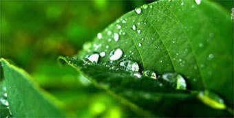
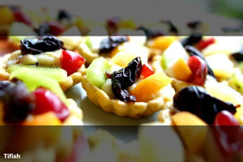
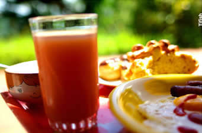

B1nj Polaroid Gallery
========================

**More information and examples : [http://b1nj.fr]**

**[Demo 1]**

**[Demo 2 with full screen]**

B1nj Polaroid Gallery is a very simple jQuery plugin.

## Getting Started

Include Css, html with the photos and script jQuery, jQuery UI, plugin on a page. This is all.

**CSS**

```html
<link rel="stylesheet" media="screen" href="css/b1njPolaroidGallery.css">
```

**HTML**

```html
<div id="gallery" class="b1njPolaroidGallery">
    <ul>
        <li><a href="img/img1-b.jpg"></a></li>
        <li><a href="img/img2-b.jpg"></a></li>
        <li></li>
        <li><a href="img/img4-b.jpg"></a></li>
    </ul>
</div>
```

**jQuery**

```html
<script src="jquery.js"></script>
<script src="jquery-ui.js"></script>
<script src="jquery.b1njPolaroidGallerry.js"></script>
<script>
    $(function() {
        $('#gallery').b1njPolaroidGallery();
    });
</script>
```

It's easy to add a nice zoom, with for example the plugin fancyBox.


##Credit

Credit Photos : Tifish - [http://www.facebook.com/tifish.photographie]

  [http://b1nj.fr]: http://www.b1nj.fr/blog/index.php?post/2012/08/19/B1nj-Polaroid-Gallery-%3A-Une-galerie-jQuery/css3/html5
  [Demo 1]: http://www.b1nj.fr/tests/b1njPolaroidGallery/
  [Demo 2 with full screen]: http://www.b1nj.fr/tests/b1njPolaroidGallery/fullscreen.html
  [http://www.facebook.com/tifish.photographie]: http://www.facebook.com/tifish.photographie

